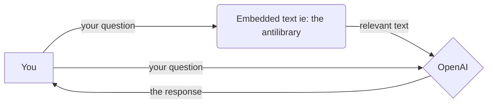

# antilibrary

A little tool that lets you ask questions from your pdfs, epubs, text files and word documents. Think Chatpdf.com or Box AI. 

Available as a notebook that launches a simple web app with a UI. Uses `langchain` and `gradio` for much of the heavy lifting. 

# How to use

Grab `Antilibrary-OpenAI.ipynb` . Save it anywhere and create a folder named `books` - that's where you should put your files. [*] Antilibrary can currently take PDF, DOC, DOCX, TXT, MD and EPUB. 

 You'll need an OpenAI API key. In the .ipynb notebook, you'll see `OPENAI_API_KEY = "your openai api key goes here"` - that's where the key goes. 

Once the key is in, run each section of the notebook.  The last section will open up an interface at the bottom. You can either open the UI in a separate browser tab, or use it directly in the notebook.

Antilibrary will read your documents and generate embeddings for them. It will then use these embeddings to search for information relevant to your question, and pass this information to OpenAI to generate the response you see. If you add new documents while the program is running, hit the `Scan the library again` button.

Here's a diagram,

I built this to explore langchain, so the current version may have a few unresolved dependencies (small fixes). Please note that because of how it does search, it's limited to direct and detailed questions; generic questions won't be of much use, and it won't act like a chatbot. 

[*] if you're running in a Google Collab, you can replace /books with a Drive folder of your choice. 

# To-do

 1. Clean up dependencies
 2. Fully local version using llama.cpp
 3. Add mobi and csv support 

